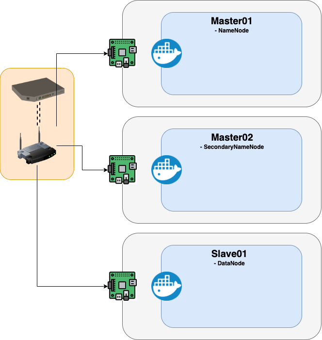

# Clustering Environment

Making a clustering environment pysique for fully distributed by the hadoop. After I terminate first step, I'll get a Spark for using a MLlib in the Clustering Environment. 

## 1. Pre-requirements 

### 1.1. Physical Requirements

* Wifi Router (Orange LiveBox)
* Raspberry Pi 4 (Ubuntu Server 18.04)
* Local Computer (OS X) 
* SD card


### 1.2. Software Environement

* openjdk-8-jdk
* hadoop-3.1.2


## 2. Preparation of images file : Ubuntu Server 18.04

Starting with the installation of Opertating System with Raspberry Pi 4. I'm able to use the Ubuntu Server version 18.04 based on the Raspberry Pi 4. 

Site : https://www.raspberrypi.org/downloads/

The ways to burn the OS to the SD card in OS X :

```shell
diskutil list # check SD card Mount

diskutil unmountDisk /dev/disk2 # unmount Disk

sudo diskutil eraseDisk FAT32 "BOOT" MBRFormat /dev/disk2 # for ubuntu 18.04 version, the format of SD card have to be FAT32

diskutil unmountDisk /dev/disk2

sudo sh -c 'gunzip -c ~/Downloads/ubuntu-18.04.4-preinstalled-server-arm64+raspi3.img.xz | sudo dd of=/dev/disk2 bs=32m'
```


Then, put the SD card into Raspberry Pi and go on head Ubuntu Settings. 


## 3. Ubuntu Settings 

### 3.1 Network

From Ubuntu Server 18.04 version, **netplan** organizes the network in the ubuntu server Machine. For the connection with Internet by wifi or by ethernet cable we need to configure a file.

```yaml
# /etc/netplan/50-cloud.init.yaml
network:
    version: 2
    renderer: networkd
    # Ways to be assigned ip by dhcp automatically in ethernet cable.
    ethernets:
        eth0:
            dhcp4: true
            optional: true
            
    # Ways to be assigned ip by static in wifis.
    wifis:
        wlan0:
                dhcp4: true
                dhcp6: false
                addresses: [192.168.2.5/24]
                gateway4: 192.168.2.1
                nameservers:
                        addresses: [8.8.8.8,8.8.4.4]
                access-points:
                        "RaspberryNetwork_Woo":
                                password: "admin"
```


### 3.2. General

```shell
# At first time, update and upgrade the package Manager(-apt)
sudo apt-get update && sudo apt-get upgrade

# take the root authority
su 
(put your new root passwd)
```


### 3.3. Firewall

```bash
# ftp,ssh,http,https open
sudo apt-get install ufw
sudo ufw enable
sudo ufw default deny
sudo ufw allow 21/tcp && sudo ufw allow 22/tcp && sudo ufw allow 80/tcp && sudo ufw allow 443/tcp

# If you want to open all ports 
sudo ufw disable
```


### 3.4. SSH

```bash
# Depending on your Raspbian OS, some of the version didn't install the ssh. 
sudo apt-get install ssh
sudo service ssh start
sudo systemctl enable ssh

# If you will use root account
sudo vi /etc/ssh/sshd_config
--(change)--
#PermitRootLogin without-password
--(to)--
PermitRootLogin yes
--(end)--

# If you can't access after reboot of device. If there isn't this file, make it 
sudo vi /etc/rc.local
--(insert)--
/bin/sh -e /etc/init.d/ssh start
--(end)--

# change the user (pi -> root)
su 
cd ~/
ssh-keygen -t rsa -P '' -f ~/.ssh/id_dsa
cd .ssh
cat id_dsa.pub >> authorized_keys
```


## 5. Docker Images

An example configuration scenario :



<p style="txt-align:center;"></img></p>

hi

